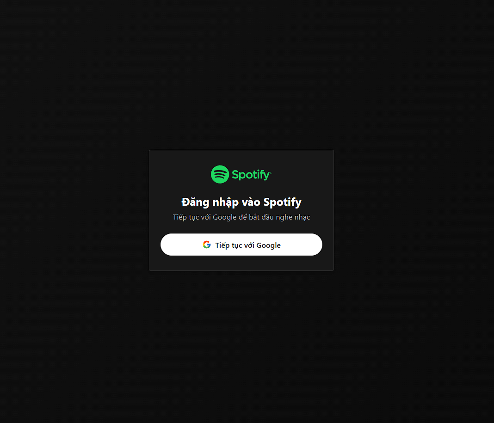
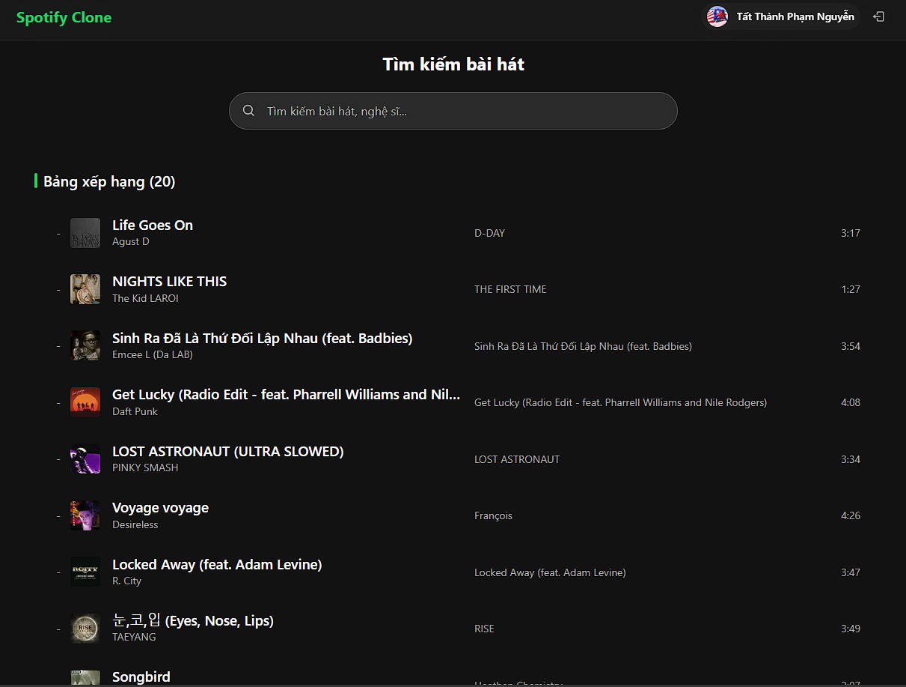
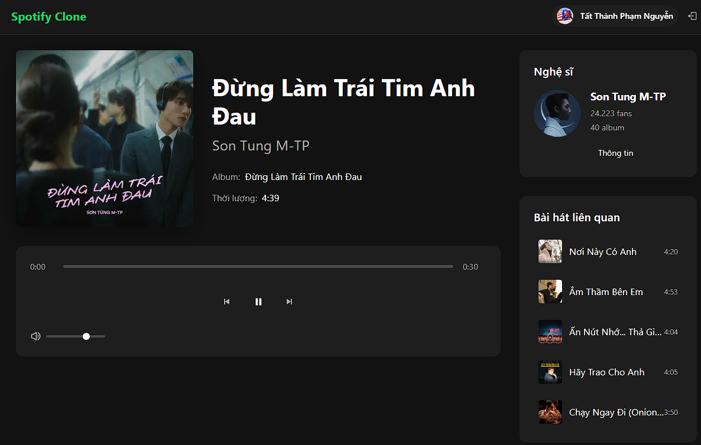
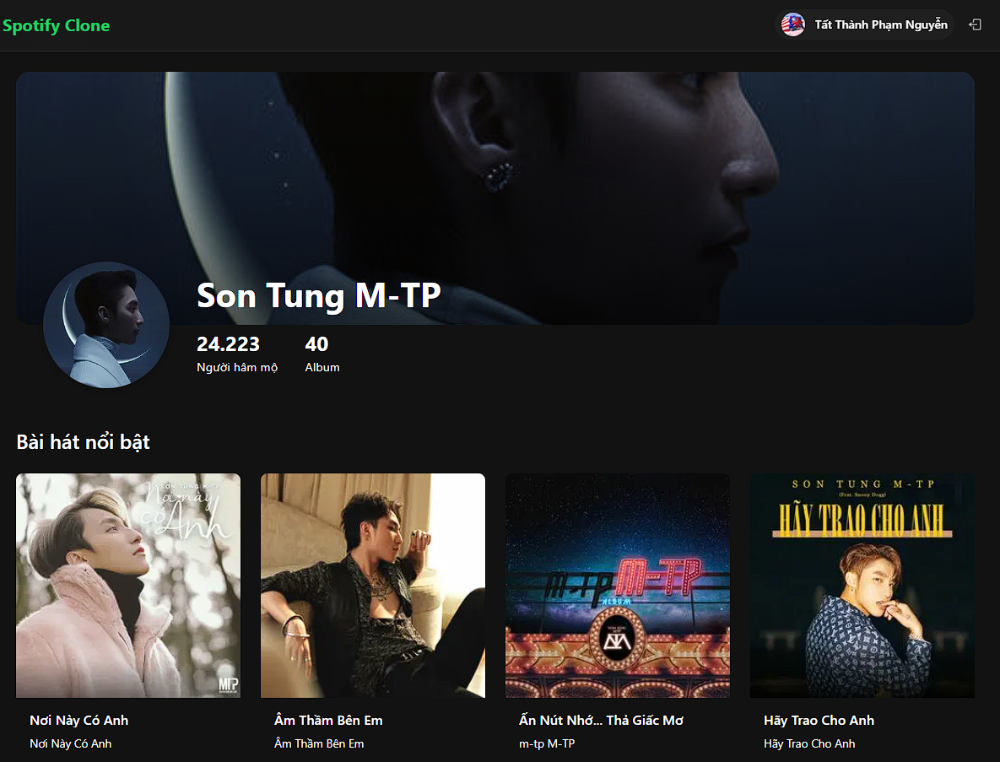

# Spotify Clone

A modern Spotify clone built with Next.js, TypeScript, and SCSS following best practices and a well-structured architecture. This application allows users to browse music tracks, search for songs, view artist details, and play music previews using the Deezer API.






## Features

- 🔐 **Authentication**: Google authentication using Firebase
- 🎵 **Music Browsing**: Browse top charts and trending tracks
- 🔍 **Search Functionality**: Search for tracks, artists, and albums
- 👤 **Artist Profiles**: View artist details and top tracks
- ▶️ **Music Player**: Play music previews with player controls
- 📱 **Responsive Design**: Fully responsive layout for all device sizes

## Tech Stack

- **Frontend**: Next.js 15, TypeScript, React 19
- **Authentication**: Firebase Authentication
- **API Integration**: Deezer API for music data
- **Styling**: SCSS with 7-1 architecture pattern
- **Routing**: Next.js App Router
- **HTTP Client**: Axios

## Project Structure

```
├── public/              # Static assets
├── src/
│   ├── app/             # Next.js app router pages
│   │   ├── (auth)/      # Authentication related routes
│   │   ├── (dashboard)/ # Protected dashboard routes
│   │   │   ├── artist/  # Artist detail pages
│   │   │   ├── track/   # Track player pages
│   │   ├── api/         # API routes
│   │
│   ├── components/      # React components
│   │   ├── dashboard/   # Dashboard components
│   │   ├── player/      # Music player components
│   │
│   ├── context/         # React context providers
│   │   ├── AuthContext.tsx
│   │
│   ├── lib/             # Utility libraries
│   │   ├── deezer/      # Deezer API integration
│   │   ├── firebase/    # Firebase configuration
│   │   ├── utils/       # Helper utilities
│   │
│   ├── styles/          # SCSS styles (7-1 architecture)
│       ├── abstract/    # Variables, mixins, functions
│       ├── base/        # Base styles, typography, resets
│       ├── components/  # Component-specific styles
│       ├── layout/      # Layout styles
│       ├── pages/       # Page-specific styles
│       ├── main.scss    # Main SCSS file
```

## Getting Started

### Prerequisites

- Node.js 18.x or later
- npm or yarn
- Firebase account and project

### Environment Variables

Create a `.env.local` file in the root directory with the following variables:

```
NEXT_PUBLIC_FIREBASE_API_KEY=your_api_key
NEXT_PUBLIC_FIREBASE_AUTH_DOMAIN=your_auth_domain
NEXT_PUBLIC_FIREBASE_PROJECT_ID=your_project_id
NEXT_PUBLIC_FIREBASE_STORAGE_BUCKET=your_storage_bucket
NEXT_PUBLIC_FIREBASE_MESSAGING_SENDER_ID=your_messaging_sender_id
NEXT_PUBLIC_FIREBASE_APP_ID=your_app_id
NEXT_PUBLIC_FIREBASE_MEASUREMENT_ID=your_measurement_id
```

### Installation

1. Clone the repository:

```bash
git clone https://github.com/PhamTatThanh-VNU/TS-Next-SCSS.git
cd TS-Next-SCSS
```

2. Install dependencies:

```bash
npm install
# or
yarn install
```

3. Start the development server:

```bash
npm run dev
# or
yarn dev
```

Open [http://localhost:3000](http://localhost:3000) with your browser to see the application.

## Architecture and Best Practices

### Authentication Flow

The application uses Firebase Authentication with Google provider for user authentication. Protected routes are secured using a custom `ProtectedRoute` component that redirects unauthenticated users to the login page.

### State Management

React Context API is used for global state management, particularly for authentication state. Each component maintains its own local state for component-specific data.

### SCSS Architecture

The project follows the 7-1 pattern for SCSS architecture:

- **abstract/**: Variables, mixins, and functions
- **base/**: Reset, typography, and other base styles
- **components/**: Component-specific styles
- **layout/**: Layout-related styles
- **pages/**: Page-specific styles

### API Integration

The Deezer API is integrated using a custom service layer that handles API requests and error handling. The API is proxied through a Next.js API route to avoid CORS issues.

## Deployment

The application can be deployed to Vercel or any other hosting provider that supports Next.js applications.

```bash
npm run build
# or
yarn build
```

## License

[MIT](LICENSE)

## Acknowledgements

- [Next.js](https://nextjs.org)
- [React](https://reactjs.org)
- [Deezer API](https://developers.deezer.com)
- [Firebase](https://firebase.google.com)
- [SCSS](https://sass-lang.com)
